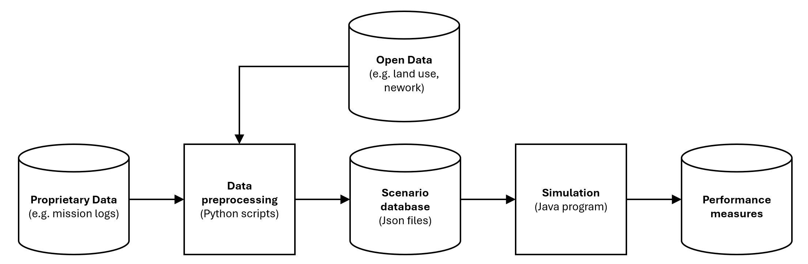

# CERTAIN repository

*This is ongoing work; both the code and its documentation are under development.*

This java program allows to simulate emergency service activities, in particular with respect to the energy needs of a future electrified emergency vehicle fleet. 

"CERTAIN" is an acronym for "Evidence-based fossil free emergency service fleet planning", which is the name of the project in which this computer problem is developed. The project is funded by the Swedish Energy Agency.

## Data flow

The following figure shows how study-region specific data (emergency service data mission logs, land-use and road network data) are prepared for simulation analysis.



The simulation program relies only on input data in Json format, subsequently called the *scenario database*. These files are designed to allow for a privacy-preserving representation the activities of a given emergency service. In particular, the occurrence of emergencies is only represented statistically as a function of land use, season, typ-of-day, and time-of-day.


## Scenario database

The files described below are sufficient to undertake a simulation analysis of a given study region. This section merely describes these files; how they are used in the simulation is described thereafter.


### Distance types

The distance types file defines what maximum vehicle speeds are possible for different types of distances. 

An example of a distance file can be found [here](./distanceTypes.json).

One may define arbitrary distance types, which are then available through their ID labels in other parts of the program.

The actual time it takes a simulated vehicle to travel a distance of a given type depends on the distance length and the *minimum* of the corresponding distance type's maximum speed and of the vehicles maximum speed.


### Incident types

The incident types file defines what incidents are possible, and how likely these incidents occur at different times.

An example of a incident type file can be found [here](./incidentTypes.json).

Time is represented along three dimensions:
* Season: SPRING, SUMMER, AUTMN, WINTER
* Type of day: WORKDAY, HOLIDAY
* Time of day: DAY, NIGHT

One may define arbitrary incident types, which are then available through their ID labels in other parts of the program.

For every incident type, a list of weights is assigned to each season, each type of day, and each time of day. The weight corresponding to any triplet (season, typeOfDay, timeOfDay) represents its relative frequency. It is computed as the product of the corresponding weights for season, type of day, and time of day. 

There is no relation between the timing weights of different incidents, only the relative values of timing weights for the same incident matter. This means that this incident type file gives no information about how likely one type of incident is relative to another type; this is encoded elsewhere. 

Omitted timings are treated as if they had a weight of zero, meaning that the considered incident is assumed to never occur at these timings.


### Zones

Zones are the spatial discretization units used by the program. The zones file defines all zones. It also specifies, for each incident type, how often that incident arises on average in that zone within one year. 

An example of a zones file can be found [here](./zones.json).

The incident frequencies are to be interpreted as expected values; the simulation program assumes that the annual number of incidents is Poission-distributed around that mean.

Incident frequencies may be estimated with a Poission regression, using the land use mix of a given zone as explanatory variables. The estimation code is currently located [here](https://github.com/filipkristoferssonVTI/CERTAIN). (This repository currently also contains a by now obsolete Python implementation of the java simulation logic described here.)


### Distances

The distances file defines the distances between all pairs of zones.

An example of a distances type file can be found [here](./distances.json).

For each pair of zones, the amount of distance per distance type is indicated. The program assumes distances to be symmetric, rendering it sufficient to specify distances in one direction.


### Stations

Emergency vehicles are parked and charged at stations. The stations file merely defines the stations and in which zone they are located. An example can be found [here](./stations.json).


### Vehicle types

A vehicle type is defined in terms of its maximum speed and its energy-related characteristics. An example can be found [here](./vehicleTypes.json).

One may define arbitrary vehicle types, which are then available through their ID labels in other parts of the program.


### Vehicles

The vehicles file defines the vehicle fleet; an example can be found [here](./vehicles.json).

Each vehicle is assigned a vehicle type and a station. Whenever the vehicle is not on a mission, it is parked at that station.


### Missions

The mission file allows a privacy-preserving representation of a given mission log. (Alternatively, it may contain the result of a model that produces representative missions).

An example of a mission file can be found [here](./missions.json).

Each mission is defined only in terms of 
* the incident type that has triggered the mission, and
* which types of vehicles are used at which (relative) times of the mission.


## Simulation logic and concrete example

The simulation logic is explained in terms of an example. The entire example code can be found [here](../src/main/java/se/vti/certain/examples/small/SmallExample.java).

First, the scenario database needs to be loaded. This happens as follows:

```
var id2VehicleType = VehicleType.readFromJsonFile(vehicleTypeFile);
var id2IncidentType = IncidentType.readFromJsonFile(incidentTypeFile);
var id2Zone = Zone.readFromJsonFile(zonesFile, id2IncidentType);
var prototypeMissions = Mission.readFromJson(anonymousMissionsFile, id2IncidentType, id2Zone, id2VehicleType);
var id2DistanceType = DistanceType.readFromJsonFile(distanceTypesFile);
var distances = Distances.readFromJsonFile(distancesFile, id2Zone, id2DistanceType);
var id2Station = Station.readFromJsonFile(stationsFile, id2Zone, distances);
var id2Vehicle = Vehicle.readFromJsonFile(vehiclesFile, id2VehicleType, id2Station);
```

Second, a simulation scenario needs to be specified. The example below considers a winter scenario with daylight from 9am to 4pm. It defines a sequence of 90 consecutive workdays. (This means that incidents are simulted for 90 days in sequence, and in each simulated day they arise with intensities corresponding to a workday.)

```
var daylightStart_h = 9.0;
var daylightEnd_h = 16.0;
var numberOfSimulatedDays = 90;
var timeLine = new SimulationTimeLine(Season.WINTER, TypeOfDay.WORKDAY, daylightStart_h, daylightEnd_h, numberOfSimulatedDays);
```

Third, a sequence of missions that may arise during this time line is simulated. This happens by running through a sequence of simulation modules.

```
var rnd = new Random();

var incidentSimulator = new IncidentSimulator(timeLine, rnd);
List<Mission> simulatedMissions = incidentSimulator.simulateMissions(id2Zone);

var timingSimulator = new TimingSimulator(timeLine, rnd);
timingSimulator.simulateTimings(simulatedMissions);

var startTimeSimulator = new StartTimeSimulator(timeLine, rnd);
startTimeSimulator.simulateStarTimes(simulatedMissions);
simulatedMissions = startTimeSimulator.getStartTimeSortedMissions(simulatedMissions);

var missionFleetSimulator = new MissionVehicleDeploymentSimulator(prototypeMissions, rnd);
missionFleetSimulator.simulateFleets(simulatedMissions);
simulatedMissions = missionFleetSimulator.getMissionsWithDeployedVehicles(simulatedMissions);

var missionImplementationSimulator = new MissionImplementationSimulator(id2Vehicle, distances);
var systemState = missionImplementationSimulator.simulateMissionImplementation(simulatedMissions);
var mission2VehicleLogs = systemState.getMission2VehicleDispachmentLog();
```

The `mission2VehicleLogs` object maps each simulated mission to a list of vehicle logs that contain detailed information about the time and energy profiles of all vehicles used in all missions.


